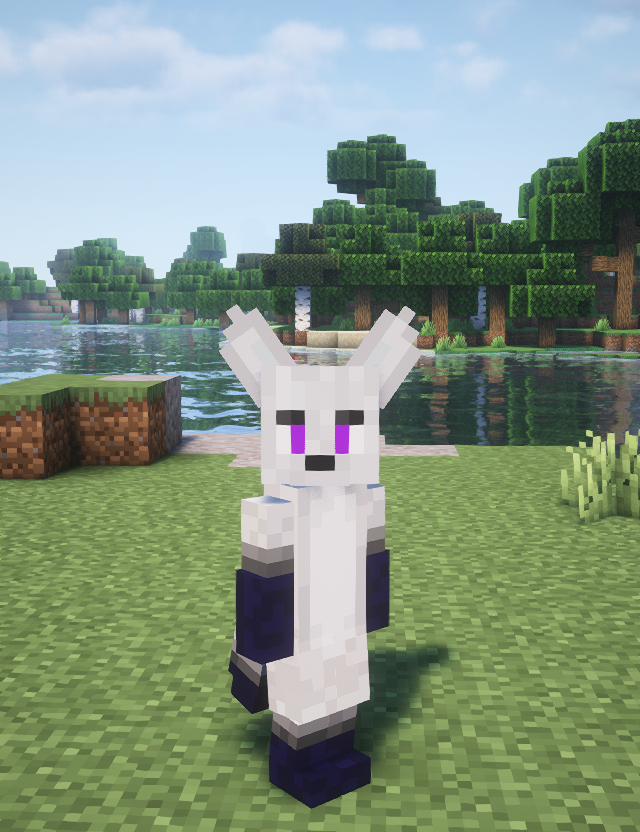
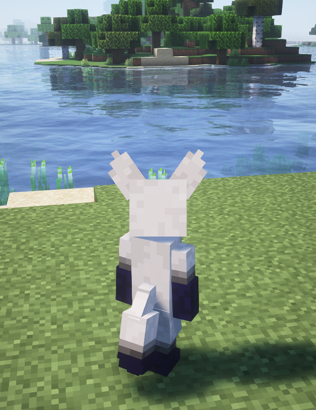

# 🌟 Figura Avatar – [Furry Fox]

This is a custom 3D avatar model for the [Figura Mod](https://modrinth.com/mod/figura), made in [Blockbench](https://www.blockbench.net/).  
You can use it as your in-game appearance in Minecraft (Fabric) with the Figura mod installed.

> ✅ **Supports:** Minecraft 1.19+ with Fabric + Figura  

---

## 📸 Preview

>
---

## 📦 Installation

1. Launch Minecraft with the **Figura** mod installed.
2. Press `R` to open the **Avatar Selector**.
3. Click **"Open Avatar Folder"**.
4. Drop the folder into the `avatars` directory.
5. Reload and select the avatar in-game.

---

## 🔧 Features

- Fully custom 3D model built in Blockbench
- Compatible with Figura scripting (Lua)
- Ready-to-use or modifiable
- Light-weight and optimized

---

## 💖 Support My Work

If you like this model and want to support more creations like this, consider buying me a coffee ☕

  

---

## 👤 About Me

Hi! I'm a **backend developer** who loves to make 3D art on the side.  
I create models using **Blender** and **Blockbench**, and I enjoy mixing code with creativity through Minecraft mods like Figura.

I occasionally release free models and tools — feel free to follow me or contribute!

---

## 📄 License

This model is licensed under the **Creative Commons Attribution 4.0 International (CC BY 4.0)** license.  
You are free to share and adapt the model as long as proper credit is given.

> © [IliaGoeti/Comry]
